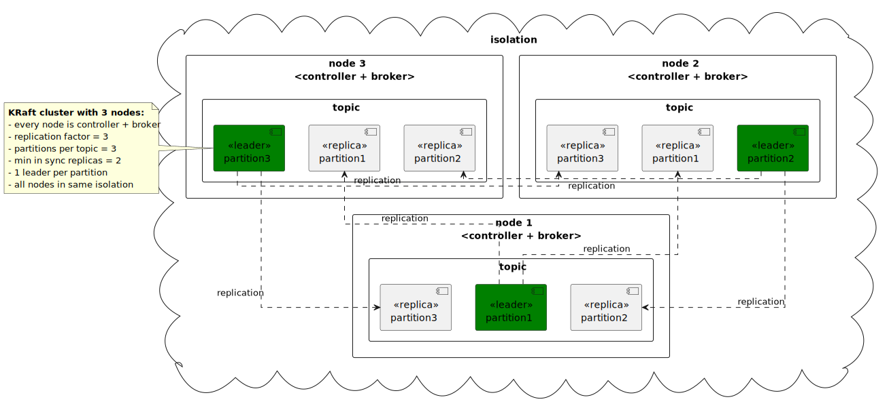
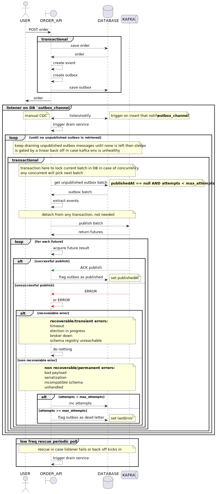
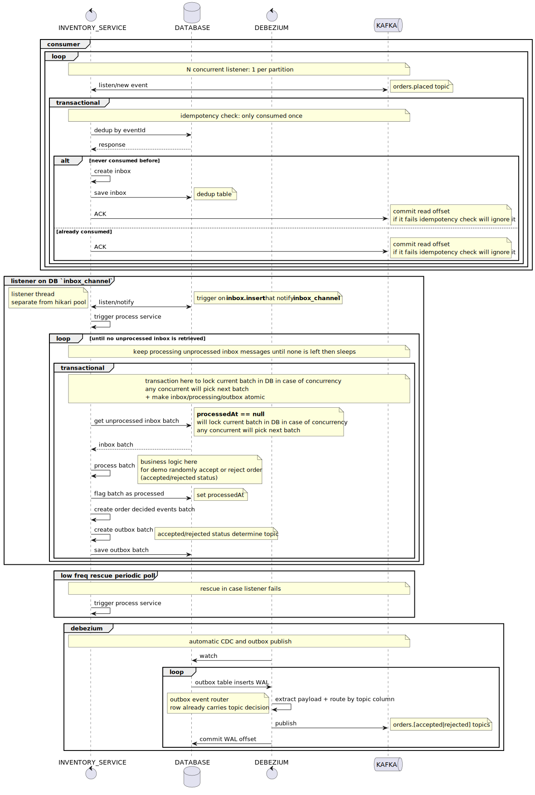

# Kafka demo


- clustering / replication/ partitioning
- Avro schema / registry
- transactional outbox write
- idempotent transactional inbox read
- manual CDC
- automatic CDC / outbox publish with Debezium
- backoff / retry / rescue
- dead lettering
- GraalVM
- mTLS

## env



can be modified using [compose.yaml](compose.yaml) and [.env](.env)

(in a real prod env it should be multiple isolation zones with N ctrls + M brokers in each zone)

## components

```yaml
kafka-demo/ # parent pom
├── commons/ # shared libs, Avro schemas/codegen, test fixtures
├── order-api/
├── inventory-service/
```

### [order-api](https://hub.docker.com/r/7mza/order-api)



### [inventory-service](https://hub.docker.com/r/7mza/inventory-service)



## run

```shell
docker compose up
```

[order-api](http://localhost:8080/swagger-ui)

[Kafbat UI](http://localhost:9090)

## test

```shell
curl -X 'POST' \
  'http://localhost:8080/api/order' \
  -H 'accept: application/json' \
  -H 'Content-Type: application/json' \
  -d '{"customerId":"user_2203","items":[{"sku":"sku-01","quantity":10,"unitPriceCents":199}]}'
```

## load test

```shell
# https://github.com/hatoo/oha

oha -n 5000 -c 500 --redirect 0 \
  -m POST \
  -H 'accept: application/json' \
  -H 'Content-Type: application/json' \
  -d '{"customerId":"user_2203","items":[{"sku":"sku-01","quantity":10,"unitPriceCents":199}]}' \
  http://localhost:8080/api/order

# -n total request
# -c concurrent connection
```

## build

[sdkman](https://sdkman.io)

[nvm](https://github.com/nvm-sh/nvm)

[docker](https://docs.docker.com/engine/install/)

```shell
nvm use && npm i && sdk env install
```

### JVM

```shell
./gradlew clean ktlintFormat ktlintCheck build -x processAot -x processTestAot
```

Spring is configured with [compose support](compose.dev.yaml), run with IDE

### GraalVM

```shell
./gradlew clean ktlintFormat ktlintCheck build -PgenerateMetadata
./gradlew buildImage
docker compose up
```
