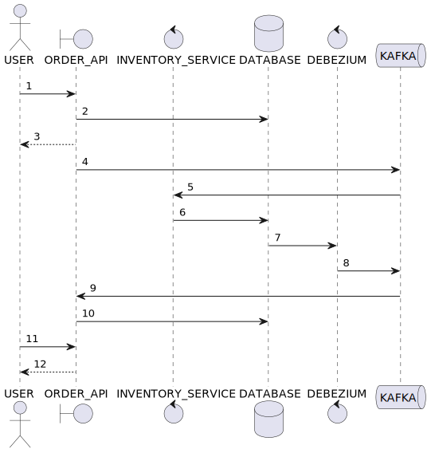

# Kafka demo


- clustering / replication / partitioning
- Avro schema / registry
- transactional outbox publish
- idempotent transactional inbox consume
- manual CDC
- automatic CDC / outbox publish with Debezium
- backoff / retry / rescue
- dead lettering
- GraalVM
- SASL / mTLS

## overview



## env


can be modified using [compose.yaml](compose.yaml) and [.env](.env)

## components

```yaml
kafka-demo/ # parent pom
├── commons/ # shared libs, Avro schemas/codegen, test fixtures
├── order-api/
├── inventory-service/
```

### [order-api](https://hub.docker.com/r/7mza/order-api)


### [inventory-service](https://hub.docker.com/r/7mza/inventory-service)


## run

```shell
docker compose up
```

[order-api](http://localhost:8080/swagger-ui) | [kafbat UI](http://localhost:9080) | [jaeger](http://localhost:16686) | [grafana](http://localhost:3000)

## test

```shell
curl -iLX 'POST' \
  'http://localhost:8080/api/order' \
  -H 'accept: application/json' \
  -H 'Content-Type: application/json' \
  -d '{"customerId":"user_2203","items":[{"sku":"sku-01","quantity":10,"unitPriceCents":199}]}'
```

## load test

[oha](https://github.com/hatoo/oha)

```shell
oha -n 5000 -c 500 --redirect 0 \
  -m POST \
  -H 'accept: application/json' \
  -H 'Content-Type: application/json' \
  -d '{"customerId":"user_2203","items":[{"sku":"sku-01","quantity":10,"unitPriceCents":199}]}' \
  http://localhost:8080/api/order

# -n total request
# -c concurrent connection
```

expect n to land in `order.placed` and around 50% of n to land in `order.[accepted|rejected]` each

## chaos test

pause or stop any Kafka container mid-load test, `order-api | inventory-service | debezium/connect` should recover
automatically after 1st timeout

## build

[sdkman](https://sdkman.io) | [nvm](https://github.com/nvm-sh/nvm)

```shell
nvm use && npm i && sdk env install
```

### JVM

```shell
./gradlew clean ktlintFormat ktlintCheck build jibDockerBuild -x processAot -x processTestAot
docker compose -f compose.jvm.yaml up
```

### GraalVM

```shell
./gradlew clean ktlintFormat ktlintCheck build -PgenerateMetadata
./gradlew buildImage
docker compose up
```
