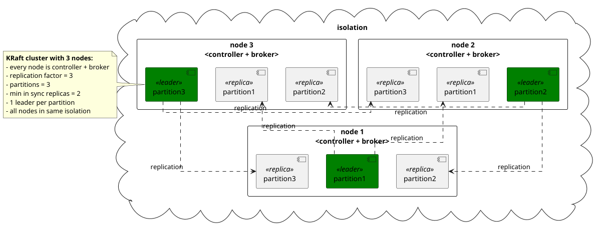
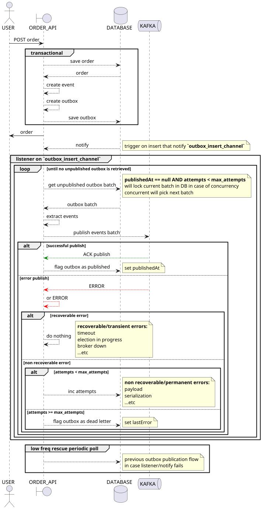

# Kafka demo


event-driven pipeline demo

## env



this env can be modified using [compose.yaml](compose.yaml) and [.env](.env)

(in a real prod env it should be multiple isolation zones with N ctrls + M brokers in each zone)

## components

### commons

shared libs

### order-api



### inventory-service

TODO

### audit-service

TODO

## run

```shell
docker compose up --build
```

[API](http://localhost:8080/swagger-ui)

[Kafbat UI](http://localhost:8081)

## build

[sdkman](https://sdkman.io)

[nvm](https://github.com/nvm-sh/nvm)

[docker](https://docs.docker.com/engine/install/)

```shell
nvm use && npm i && sdk env install
```

### JVM

```shell
./gradlew clean ktlintFormat ktlintCheck build -x processAot -x processTestAot
```

Spring is configured with [compose support](compose.dev.yaml), run with IDE

### GraalVM

```shell
./gradlew clean ktlintFormat ktlintCheck build -PgenerateMetadata
./gradlew buildImage
docker compose up --build
```
